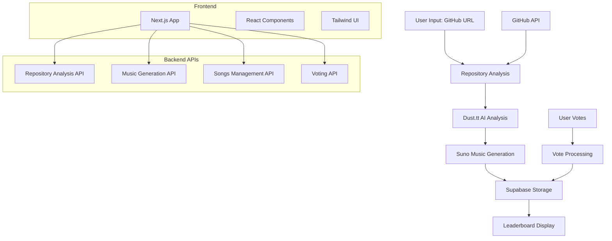

# GitBeat

GitBeat is a web application that transforms GitHub repositories into music. Analyze your code repository and generate unique beats based on its structure, contributors, and development patterns.

## Features

- **Repository Analysis**: Deep analysis of GitHub repositories including contributor statistics, language breakdown, and project health metrics
- **AI-Powered Music Generation**: Uses Suno AI to create custom beats based on repository analysis
- **Interactive Leaderboard**: Vote for your favorite generated beats and see popularity rankings
- **Contributor Insights**: AI-generated personality profiles for repository contributors
- **Responsive Design**: Works seamlessly on desktop and mobile devices

## Technology Stack

- **Frontend**: Next.js 15 with React 19, TypeScript
- **Styling**: Tailwind CSS v4, shadcn/ui components
- **Database**: Supabase (PostgreSQL)
- **AI Services**: 
  - **Dust.tt** for repository analysis
  - **OpenAI** Agent to analyze the repo using the GitHub MCP
  - **Lovable** Front-end and design iteration
  - Suno AI for music generation
- **APIs**: GitHub API for repository data

## Architecture



## Getting Started

### Prerequisites

- Node.js 18+ or Bun
- Supabase account and project
- Dust.tt API access
- Suno AI API access

### Environment Variables

Create a `.env.local` file in the `frontend` directory:

```bash
NEXT_PUBLIC_SUPABASE_URL=your_supabase_url
NEXT_PUBLIC_SUPABASE_ANON_KEY=your_supabase_anon_key
SUPABASE_SERVICE_ROLE_KEY=your_supabase_service_role_key
DUST_API_KEY=your_dust_api_key
DUST_WORKSPACE_ID=your_dust_workspace_id
SUNO_API_TOKEN=your_suno_api_token
OPENAI_API_KEY=your_openai_api_key
```

### Installation

1. Clone the repository:
```bash
git clone <repository-url>
cd gitbeat
```

2. Navigate to the frontend directory:
```bash
cd frontend
```

3. Install dependencies:
```bash
npm install
# or
bun install
```

4. Set up the database schema using the provided SQL file:
```bash
# Run the contents of supabase-schema.sql in your Supabase SQL editor
```

5. Start the development server:
```bash
npm run dev
# or
bun dev
```

6. Open [http://localhost:3000](http://localhost:3000) in your browser.

## Usage

### Generating Music from Repositories

1. Navigate to the "Beats" tab
2. Enter a GitHub repository URL
3. Click "Analyze" to start the process
4. Wait for AI analysis and music generation to complete
5. Your generated beat will appear in the leaderboard

### Repository Analysis

1. Switch to the "Analysis" tab
2. Enter a GitHub repository URL
3. Choose between "Professional" or "Fun" analysis tone
4. Click "Analyze Repository" to get detailed insights
5. View contributor statistics, language breakdown, and AI-generated team insights

### Voting and Leaderboard

- Click the upvote button on any beat to increase its popularity
- Beats are ranked by upvote count
- Real-time animations show ranking changes
- Play/pause any beat directly from the leaderboard

## API Endpoints

### Songs Management
- `GET /api/songs` - Fetch all songs
- `POST /api/songs/upload` - Upload a new song
- `POST /api/songs/ai-generated` - Save AI-generated song
- `POST /api/songs/[id]/upvote` - Upvote a song

### Music Generation
- `POST /api/suno/generate` - Generate music with Suno AI
- `GET /api/suno/status/[taskId]` - Check generation status
- `POST /api/suno/callback` - Suno webhook callback

### Repository Analysis
- `POST /api/dust/conversation` - Analyze repository with Dust.tt
- `POST /api/analyze-contributors` - Get contributor insights

## Development

### Code Structure

```
frontend/
├── app/                 # Next.js app directory
│   ├── api/            # API routes
│   ├── globals.css     # Global styles
│   ├── layout.tsx      # Root layout
│   └── page.tsx        # Home page
├── lib/                # Utility libraries
│   ├── hooks/          # Custom React hooks
│   ├── types/          # TypeScript type definitions
│   └── utils.ts        # Utility functions
└── public/             # Static assets
```

### Key Components

- **Music Generation Flow**: Handles repository analysis to music generation pipeline
- **Leaderboard**: Interactive voting system with real-time updates
- **Repository Analysis**: GitHub data fetching and AI-powered insights
- **Polling System**: Manages async music generation status

## Contributing

1. Fork the repository
2. Create a feature branch
3. Make your changes
4. Add tests if applicable
5. Submit a pull request

## License

This project is licensed under the MIT License.